# Mobil Proglama Final Ödevi

# 🐮 Hangisi - Güvenilir Gıda Takip Uygulaması

**Hangisi**, üreticiler ve tüketiciler arasında şeffaf bir köprü kurmayı amaçlayan, Mobil Programlama dersi için geliştirilmiş kapsamlı bir Flutter projesidir. Üreticilerin tarımsal ürünlerini tohum, gübre, ilaçlama bilgileriyle birlikte kaydedebildiği, tüketicilerin ise bu ürünleri şeffaf bir şekilde görüntüleyebildiği bir platformdur.

## 📱 Ekran Görüntüleri

  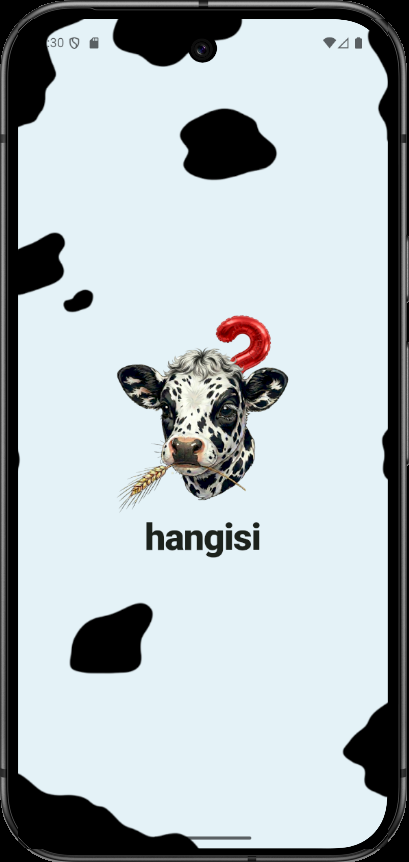
  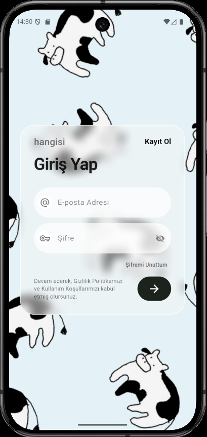
  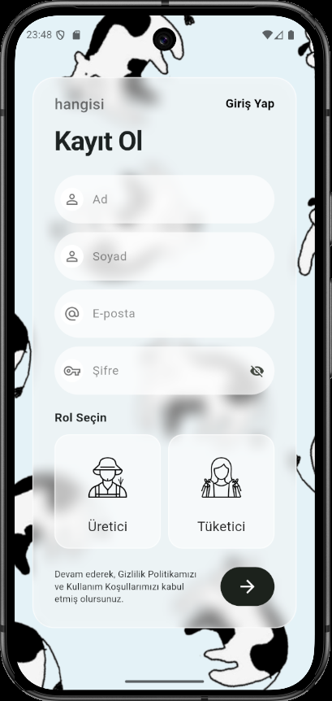
  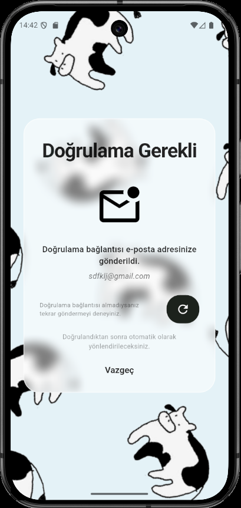
  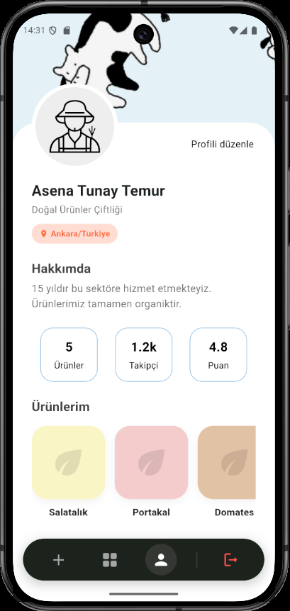
  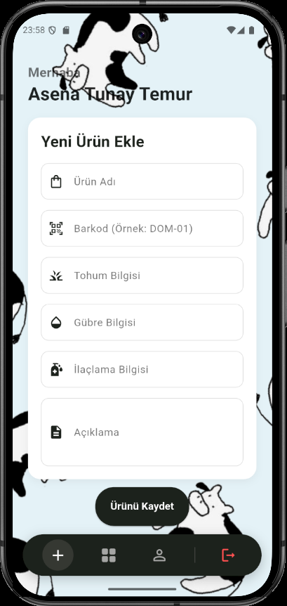
  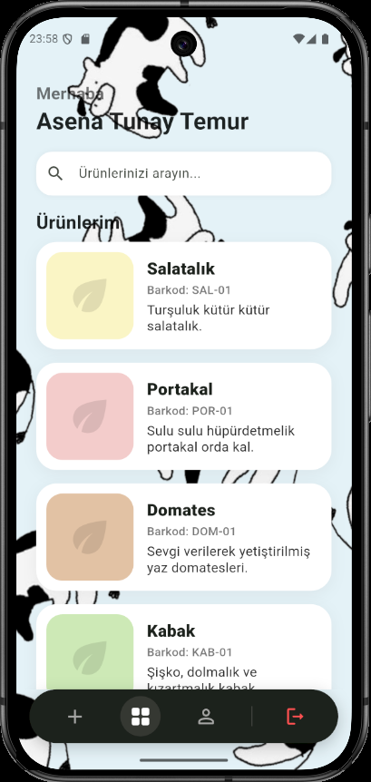
  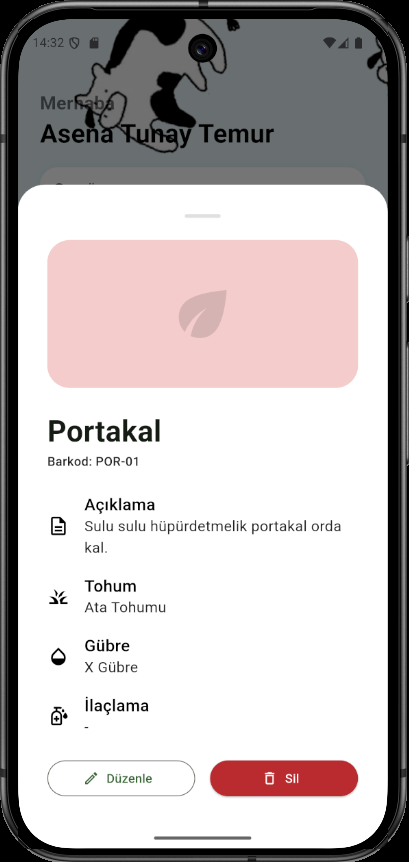
  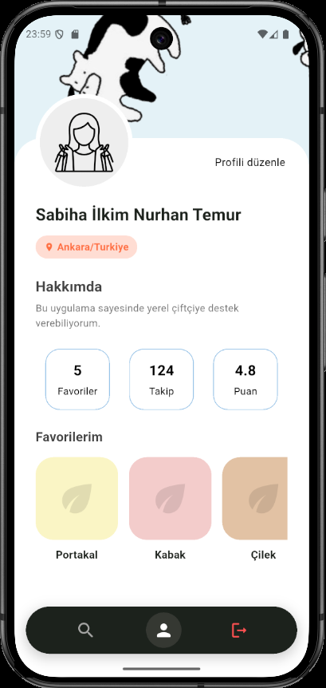
  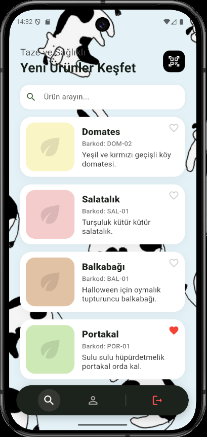
  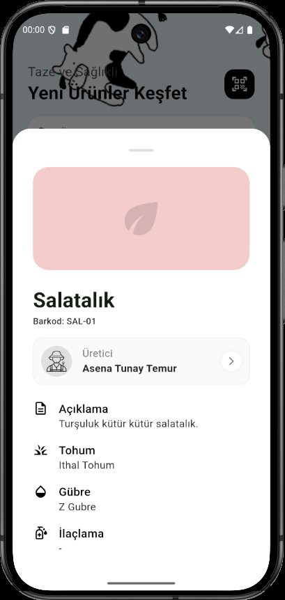

## ✨ Özellikler

* **Rol Tabanlı Kimlik Doğrulama:**
    * Firebase Auth altyapısı.
    * Üretici ve Tüketici olarak ayrı kayıt ve giriş imkanı.

* **Üretici Modülü:**
    * Profil Yönetimi (Çiftlik adı, konum, hakkımda bilgisi düzenleme).
    * Ürün Yönetimi (Ürün ekleme, düzenleme, silme).
    * Detaylı Ürün Takibi (Barkod, tohum cinsi, gübreleme ve ilaçlama bilgisi).

* **Barkod ile Sorgulama:** Tüketiciler ürün üzerindeki barkod sayesinde ürünün tüm geçmişine ulaşabilir.

* **Kullanıcı Arayüzü (UI/UX):**
    * Modern **Glassmorphism** tasarım dili.
    * Pastel tonlarda renk paleti.
    * Responsive (Duyarlı) tasarım (Yatay/Dikey ekran uyumu).
    * Özel animasyonlu input alanları.

* **Veri Tabanı:**
    * Google Cloud Firestore ile gerçek zamanlı veri saklama.

## 🛠 Kullanılan Teknolojiler

* **Flutter & Dart:** UI ve Mobil Geliştirme.
* **Firebase Authentication:** Kullanıcı kayıt ve giriş işlemleri.
* **Cloud Firestore:** Gerçek zamanlı veritabanı (Kullanıcılar ve Ürünler için).
* **Firebase Core:** Firebase entegrasyonu.

*Geliştirici: [Asena Tunay Temur]*